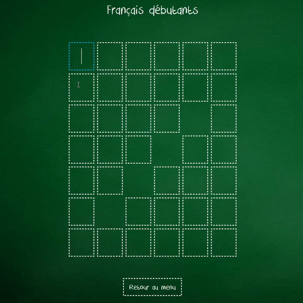

# MotsCroisesFX
Un jeu de mots croisés avec 11 grilles différentes (en anglais & français) et 3 niveaux de difficulté. 
L'interface graphique a été fait avec JavaFX en utilisant un pattern MVC.

<h2> Présentation rapide du jeu : </h2>

 
  Menu principal
  

  

 
  Choix de la grille
  
  
Liste des grilles disponibles :
<table>
  <tr>
    <th>N°</th>
    <th>Intitulé</th>
    <th>Difficulté</th>
  </tr>
  <tr>
    <td>1 to 8</td>
    <td>Anglais</td>
    <td>Moyen<td>
  </tr>
  <tr>
    <td>9</td>
    <td>NYT</td>
    <td>Expert<td>
  </tr>
  <tr>
    <td>10</td>
    <td>Français</td>
    <td>Débutant<td>
  </tr>
  <tr>
    <td>11</td>
    <td>Français</td>
    <td>Impossible<td>
  </tr>
</table>

 

<h2> Déroulement d'une partie : </h2> 

  Un focus bleu apparait sur la case sélectionnée dans laquelle on veut ecrire une lettre (miniscule uniquement*) 
  

 
  Les définitions apparaissent en info-bulle quand le curseur est placé sur une case [Définition horizontale / Définition verticale]
   

 
  Le focus se deplace automatiquement vers la case suivante (horizontalement ou verticalement) quand on ecrit une lettre dans la case selectionnée
  et inversement quand on supprime une lettre.
   

 
  Appuyer sur la touche ENTER permet de vérifier si les lettres placées sont correctes, les cases sont colorées en vert si c'est le cas (sinon rien).
   

 
  Appuyer sur le clic central permet de devoiler la solution d'une case.
   

  La partie se termine une fois que toutes les cases sont correctement remplies (appuyer la touche ENTER), une fenetre de fin de partie apparait alors.
   

